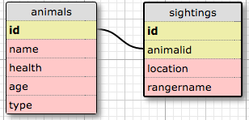

# Wildlife Tracker

#### Epicodus Java Week 4 Independent Project, 09.30.2016

#### By _**Sheena Nickerson**_

## Description

This is a web application that allows Forest Service Rangers to record wildlife sightings. There are two categories of wildlife: Animals and Endangered Animals.

## Database Schema

## Technical Specifications

| Behavior                         | Example Input          | Example Output                       |
|----------------------------------|------------------------|--------------------------------------|
| Store animal name                | 'coyote'               | 'coyote'                             |
| Store endangered animal's health | 'healthy'              | 'healthy'                            |
| Store endangered animal's age    | 'newborn'              | 'newborn'                            |
| Return all animals               | All animals            | {'coyote', 'bear', 'deer'}           |
| Return all endangered animals    | All endangered animals | {'bald eagle'}                       |
| Store animal id in sighting      | 1                      | 1                                    |
| Store location in sighting       | 'Zone A'               | 'Zone A'                             |
| Store ranger name in sighting    | 'Walker'               | 'Walker'                             |
| List all sightings by animal     | bear sightings         | {Sighting 1, Sighting 2, Sighting 3} |
| Update animal information        | 'grizzly bear'         | 'grizzly bear'                       |
| Update sighting information      | 1, 'Zone B', 'Walker'  | 1, 'Zone B', 'Walker'                |
| Delete an animal                 | 'grizzly bear'         | null                                 |
| Delete a sighting                | Sighting 1             | null                                 |

## Setup/Installation Requirements

In PSQL:
* CREATE DATABASE wildlife_tracker;
* CREATE TABLE animals (id serial PRIMARY KEY, name varchar, health varchar, age varchar, type varchar);
* CREATE TABLE sightings (id serial PRIMARY KEY, animal_id int, location varchar, ranger_name varchar);

In your terminal:
* Clone this repository from [github](https://github.com/sheenanick/java-wildlife-tracker).
* Run the main method by typing 'gradle run'.

View http://localhost:4567 in a web browser of your choice.

## Support and contact details

Please feel free to contact me at sheenanick@gmail.com if you have any issues or questions, ideas or concerns.

## Technologies Used

Java
JUnit
Spark
Gradle
PostgreSQL

### License

*Licensed under GPL.*

Copyright (c) 2016 **_Sheena Nickerson_**
